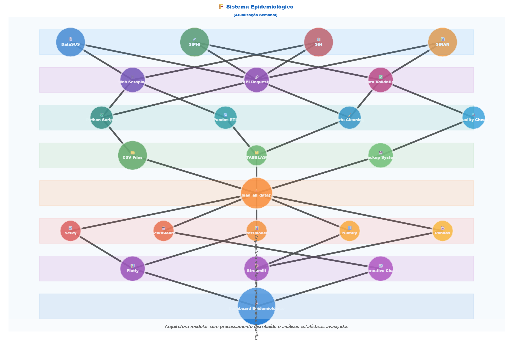

# Meningitis Brazil: Epidemiological Analysis Dashboard Meningite Brasil: Painel de Análise Epidemiológica

[](https://www.python.org/)
[](https://streamlit.io/)
[](https://www.docker.com/)

An advanced Streamlit-based dashboard for comprehensive epidemiological analysis of Meningitis in Brazil. This tool integrates data from multiple official sources, offering a wide range of statistical analyses, machine learning models, and interactive visualizations to monitor and understand the dynamics of the disease.

Um dashboard avançado baseado em Streamlit para análise epidemiológica completa da Meningite no Brasil. Esta ferramenta integra dados de múltiplas fontes oficiais, oferecendo uma vasta gama de análises estatísticas, modelos de machine learning e visualizações interativas para monitorar e entender a dinâmica da doença.

## 🏛️ System Architecture / Arquitetura do Sistema

The system is designed with a modular and automated data pipeline, ensuring that the analyses are based on the most up-to-date information available from official public health sources.

O sistema é projetado com um pipeline de dados modular e automatizado, garantindo que as análises sejam baseadas nas informações mais atualizadas disponíveis de fontes oficiais de saúde pública.



## ✨ Features / Funcionalidades

This dashboard provides a rich set of features for in-depth analysis:

Este dashboard oferece um rico conjunto de funcionalidades para análises aprofundadas:

-   **General Overview (2024)**: Key metrics for the current year, including suspected cases, confirmed deaths, and overall lethality.
-   **Case Analysis (2017-2024)**: Temporal evolution of notified cases, seasonality patterns, and trend analysis.
-   **Serogroup Analysis**: Lethality rates by serogroup, non-linear relationship analysis, and temporal evolution of lethality.
-   **Etiology Analysis**: Case distribution by etiology, Principal Component Analysis (PCA), and correlation matrix between different causes.
-   **Immunization Analysis**: Impact of vaccination coverage on case numbers, regional disparities, and predictive ARIMA modeling.
-   **Regional Analysis**: Detailed geographic distribution, temporal evolution by region, and comparative statistics.
-   **Advanced Analysis**: Advanced time series decomposition (STL), cross-correlation analysis, multiple regression, and hierarchical clustering.
-   **Epidemiological Analysis**: In-depth look at lethality rates, attack rates, and force of infection.
-   **Free Exploration**: An interactive interface to freely explore, filter, and download the datasets.
-   **Reports and Downloads**: Automated generation of summary reports and download of processed data.
-   **Technical Exposition**: A detailed breakdown of the system's architecture, data structure, and statistical methodologies.

-   **Visão Geral (2024)**: Métricas principais do ano corrente, incluindo casos suspeitos, óbitos confirmados e letalidade geral.
-   **Análise de Casos (2017-2024)**: Evolução temporal dos casos notificados, padrões de sazonalidade e análise de tendência.
-   **Análise de Sorogrupos**: Taxas de letalidade por sorogrupo, análise de relações não-lineares e evolução temporal da letalidade.
-   **Análise de Etiologia**: Distribuição de casos por etiologia, Análise de Componentes Principais (PCA) e matriz de correlação entre diferentes causas.
-   **Análise de Imunização**: Impacto da cobertura vacinal no número de casos, disparidades regionais e modelagem preditiva com ARIMA.
-   **Análise Regional**: Distribuição geográfica detalhada, evolução temporal por região e estatísticas comparativas.
-   **Análises Avançadas**: Decomposição de séries temporais avançada (STL), análise de correlação cruzada, regressão múltipla e clustering hierárquico.
-   **Análise Epidemiológica**: Análise aprofundada das taxas de letalidade, taxas de ataque e força de infecção.
-   **Exploração Livre**: Uma interface interativa para explorar, filtrar e baixar os datasets livremente.
-   **Relatórios e Downloads**: Geração automatizada de relatórios resumidos e download de dados processados.
-   **Expositivo Técnico**: Um detalhamento da arquitetura do sistema, estrutura de dados e metodologias estatísticas.

## 📊 Data Sources / Fontes de Dados

The data is automatically collected and processed from the following official Brazilian public health systems:

Os dados são coletados e processados automaticamente a partir dos seguintes sistemas oficiais de saúde pública do Brasil:

-   **DataSUS**: Departamento de Informática do Sistema Único de Saúde.
-   **SINAN**: Sistema de Informação de Agravos de Notificação.
-   **SIPNI**: Sistema de Informações do Programa Nacional de Imunizações.
-   **SIH**: Sistema de Informações Hospitalares.

The raw and processed data are stored in the `TABELAS/` and `data/` directories, respectively.

Os dados brutos e processados são armazenados nos diretórios `TABELAS/` e `data/`, respectivamente.

## 💻 Technology Stack / Tecnologias Utilizadas

-   **Backend & Frontend**: Python, Streamlit
-   **Data Manipulation**: Pandas, NumPy
-   **Statistical Analysis**: SciPy, Statsmodels
-   **Machine Learning**: Scikit-learn
-   **Visualization**: Plotly, Matplotlib, Seaborn
-   **Containerization**: Docker

## 🚀 Setup and Installation / Instalação e Configuração

### Prerequisites / Pré-requisitos

-   Python 3.10+
-   Docker (for containerized setup)

### Option 1: Virtual Environment (Recommended) / Opção 1: Ambiente Virtual (Recomendado)

1.  **Clone the repository / Clone o repositório:**
    ```bash
    git clone <repository-url>
    cd <repository-directory>
    ```

2.  **Create and activate a virtual environment / Crie e ative um ambiente virtual:**
    ```bash
    # Windows
    python -m venv .venv
    .venv\\Scripts\\activate

    # macOS / Linux
    python3 -m venv .venv
    source .venv/bin/activate
    ```

3.  **Install dependencies / Instale as dependências:**
    ```bash
    pip install -r requirements.txt
    ```

### Option 2: Docker

1.  **Build the Docker image / Construa a imagem Docker:**
    ```bash
    docker-compose build
    ```

## ▶️ How to Run / Como Executar

### Local Execution / Execução Local

After installing the dependencies, run the following command:

Após instalar as dependências, execute o seguinte comando:

```bash
streamlit run dashboard_completo_v2.py
```

Open your browser and navigate to `http://localhost:8501`.

Abra seu navegador e acesse `http://localhost:8501`.

### Docker Execution / Execução com Docker

```bash
docker-compose up
```

The application will be available at `http://localhost:8501`.

A aplicação estará disponível em `http://localhost:8501`.

## 🗂️ Project Structure / Estrutura do Projeto

```
.
├── TABELAS/              # Stores raw and semi-processed CSV data
├── app/                  # Application-specific modules (if any)
├── app_sections/         # Potential modular sections for the app
├── data/                 # Stores processed data and other assets
├── Dockerfile            # Docker configuration for the application
├── docker-compose.yml    # Docker Compose configuration
├── dashboard_completo_v2.py # Main Streamlit application script
├── requirements.txt      # Python dependencies
├── README.md             # This file
└── ...                   # Other scripts and notebooks
```

## 🔬 Methodology / Metodologia

The dashboard employs a wide range of statistical and machine learning techniques to analyze the data, including:

O dashboard emprega uma vasta gama de técnicas estatísticas e de machine learning para analisar os dados, incluindo:

-   **Descriptive Statistics**: Measures of central tendency and dispersion.
-   **Correlation Analysis**: Pearson, Spearman, and cross-correlation tests.
-   **Regression Models**: Linear, multiple, and polynomial regression to identify trends and relationships.
-   **Time Series Analysis**: Advanced decomposition (STL), stationarity tests (ADF), and predictive modeling (ARIMA).
-   **Machine Learning**: K-Means and Hierarchical Clustering for segmentation, and PCA for dimensionality reduction.
-   **Epidemiological Metrics**: Calculation of attack rates, force of infection, and lethality rates to measure public health impact.

-   **Estatística Descritiva**: Medidas de tendência central e dispersão.
-   **Análise de Correlação**: Testes de Pearson, Spearman e correlação cruzada.
-   **Modelos de Regressão**: Regressão linear, múltipla e polinomial para identificar tendências e relações.
-   **Análise de Séries Temporais**: Decomposição avançada (STL), testes de estacionariedade (ADF) e modelagem preditiva (ARIMA).
-   **Machine Learning**: Clustering K-Means e Hierárquico para segmentação, e PCA para redução de dimensionalidade.
-   **Métricas Epidemiológicas**: Cálculo de taxas de ataque, força de infecção e taxas de letalidade para medir o impacto na saúde pública.